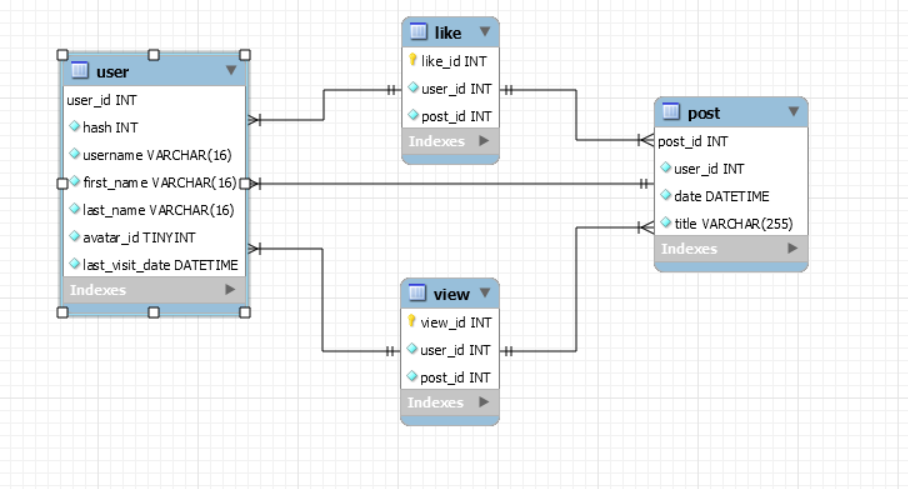

# Deepone application 2.0
Social network Spring Boot backend application.
## Technologies
- Java 11
- Spring Boot 2.7.6
- Hibernate
- MySQL
## Architecture
Web Server - Application - ORM - Database

**Modules**

PostView module:

View with post and user data.
- model/PostView.java
- repository/PostViewRepository.java
- service/PostViewService.java
- controller/PostViewController.java

Post module:

Post data.
- model/Post.java

User module:

User data.
- model/User.java

View module:

Information about post views.
- model/View.java

Like module:

Information about liked posts.
- model/Like.java

## Data Schema

## API
**Post module**

Get current user feed:
- GET /api/feed(pageNum)

pageNum - feed page number (int).
## Screenshots